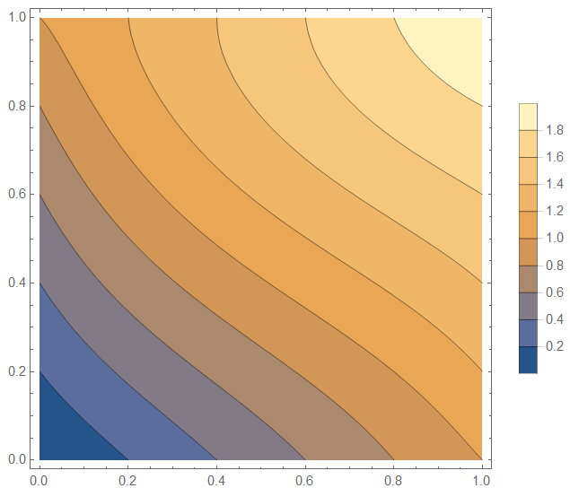
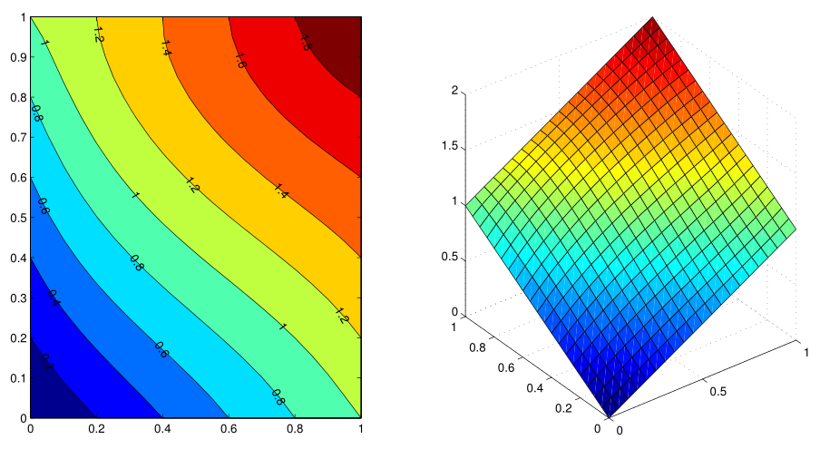
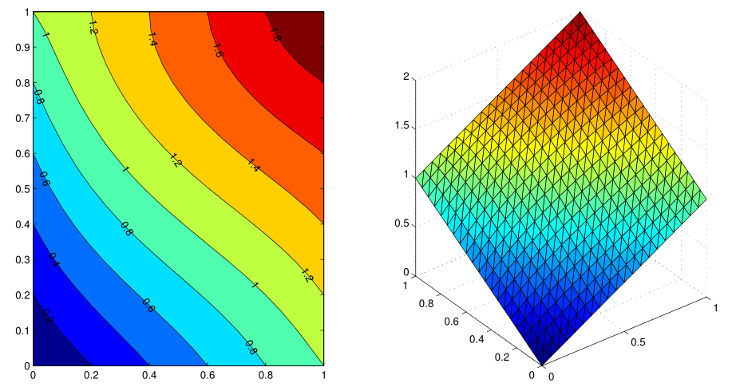
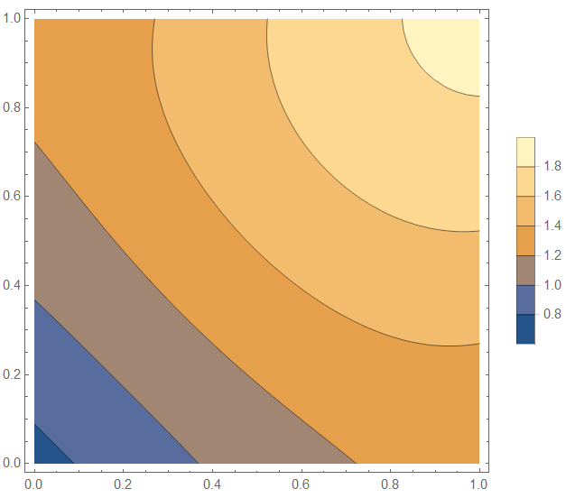
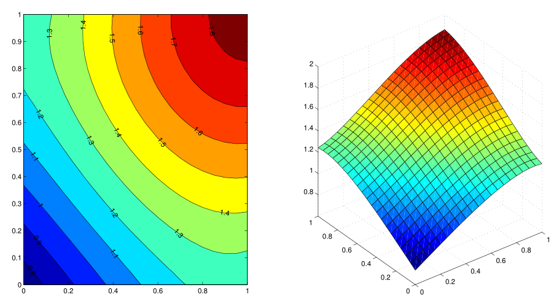
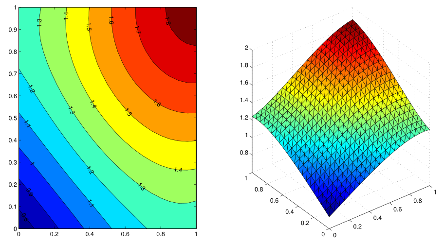

# Finite Element Method for Solving 2D Poisson Equation

Element type: quadrilateral, triangle

Basis (shape) function: bilinear for quadrilateral elements, linear for triangle elements

Boundary condition: Dirichlet (first-type), Robin (generalized Neumann, third-type)

Notice: the Robin BC in this program has the form: $\displaystyle \frac{\partial u}{\partial \vec{n}} + \alpha u = g, (x,y) \in \partial \Omega$ (the coefficients are normalized and merged into $\alpha$ and $g$)

## Numerical Experiment

### Test Case 1

Equation: 
$$
- \nabla^2 u(x,y) = 3x - 6y, (x, y) \in (0, 1) \times (0, 1) \\
u(x, 0) = x, u(x, 1) = 1 + x, u(0, y) = y, u(1, y) = 1 + y
$$

Mathematica result:

2D FEM with quadrilateral element:

2D FEM with triangular element:

### Test Case 2

Equation: 
$$
- \nabla^2 u(x,y) = 5xy, (x, y) \in (0, 1) \times (0, 1) \\
\frac{\partial u(x,y)}{\partial \vec{n}} + u(x,y) = x + y
$$

Mathematica result:

2D FEM with quadrilateral element:

2D FEM with triangular element:

